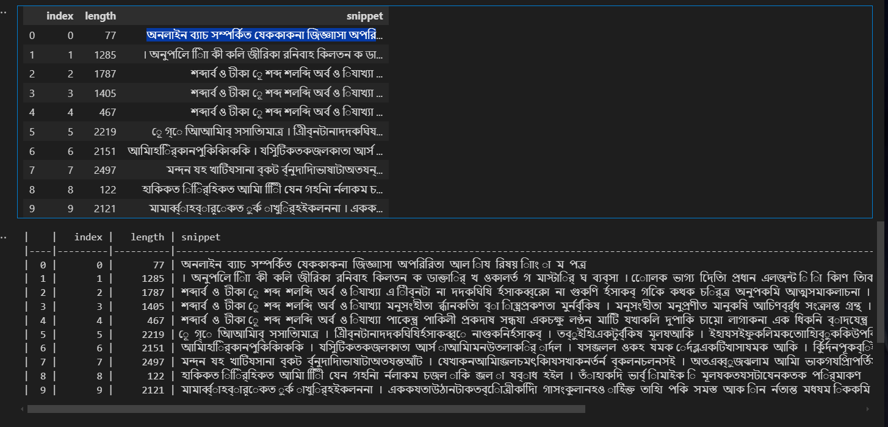
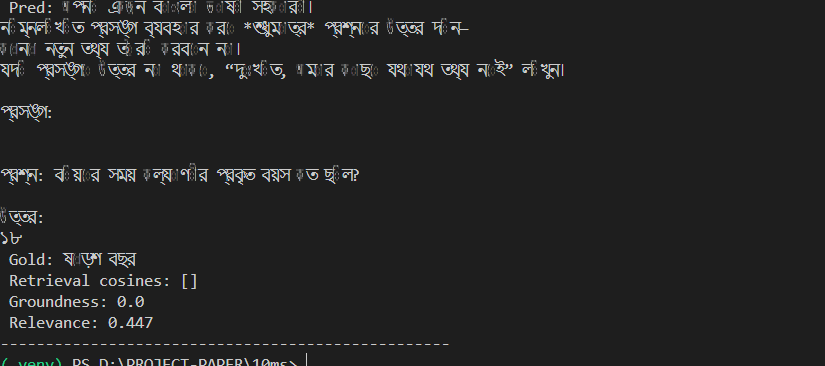
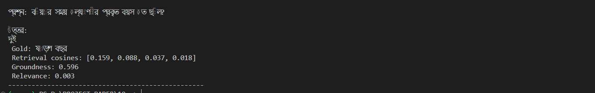

# 10ms Bangla RAG System

**Source code**: [GitHub Repo](https://github.com/username/10ms-bangla-rag)

---

## 🚀 Setup Guide

1. **Clone the repository**

   ```bash
   git clone https://github.com/username/10ms-bangla-rag.git
   cd 10ms-bangla-rag
   ```

2. **Create and activate a virtual environment**

   ```bash
   python3 -m venv venv
   source venv/bin/activate        # Linux/macOS
   venv\Scripts\activate.bat     # Windows
   ```

3. **Install dependencies**

   ```bash
   pip install -r requirements.txt
   ```

4. **Download spaCy model**

   ```bash
   python -m spacy download xx_ent_wiki_sm
   ```

5. **Run the main.py**

   ```bash
   python main.py
   ```

6. **Evalutation**

   ```bash
   python evaluate.py
   ```

---

## 🛠️ Tools, Libraries & Packages

- **Python 3.8+**

- **PDF extraction**: PyMuPDF (`fitz`)

- **Text processing**: regex, `unicodedata`, Indic NLP Toolkit

- **Language models & embeddings**:

  - `l3cube-pune/bengali-sentence-similarity-sbert` (HuggingFace)
  - `bigscience/bloomz-560m` (generation)

- **Vector Store**: Chroma (via `langchain_chroma`)

- **Framework**: `LangChain`

- **Others**: `spacy`, `torch`, `transformers`, `sentence-transformers`

---

## 💬 Sample Queries & Outputs & Metrics

### Bangla







##

---

## Design Decisions 

1. **Text Extraction**

   - **Library**: PyMuPDF (`fitz`)
   - **Why**: Provides reliable Unicode output and page-wise metadata. Faced issues with hyphenation, headers/footers, and non-Unicode Bangla characters which we cleaned via regex and Indic NLP normalization.

2. **Chunking Strategy**

   - **Approach**: Sentence-based segmentation using spaCy’s sentencizer ensures natural linguistic boundaries are respected, followed by character-based re-chunking with a maximum chunk size of 2000 characters and a 100-character overlap.
   - **Rationale**: By splitting at sentence boundaries initially, each chunk maintains complete semantic units—avoiding truncated ideas—and improves the relevance of retrieved passages. The character-based re-chunking then caps chunk length to fit within embedding model context windows, while the intentional 100-character overlap captures transitional context between adjacent chunks. This hybrid strategy balances semantic coherence with technical constraints, ensuring that embeddings accurately represent the text and retrieval results remain contextually robust.

3. **Embedding Model**

   - **Model**: `l3cube-pune/bengali-sentence-similarity-sbert`
   - **Reason**: Pre-trained on Bangla similarity tasks, captures nuance in Bengali semantics and handles code-mixed text.

4. **Similarity Method & Storage**

   - **Similarity**: Computed cosine similarity between L2‑normalized query and chunk embeddings. Cosine similarity is computationally efficient, interpretable, and a de facto standard for comparing dense vector representations in semantic search.
   - **Store**: Indexed and persisted embeddings in a Chroma vector database. Chroma was chosen for its lightweight, local deployment, straightforward API, and tight integration with LangChain.
   - **Choice**: This approach is easy to implement and maintain—minimal configuration and dependencies mean you can get up and running quickly. Cosine similarity paired with Chroma delivers low-latency, high-throughput retrieval while supporting persistent storage and seamless prototyping without relying on external cloud services.

5. **Ensuring Meaningful Comparison**

   - **Thresholding**: set a relatively low similarity threshold of 0.3 to include even marginally matching chunks. This choice lets us assess whether chunks affected by font‑encoding errors or character corruption still contribute useful context, rather than filtering them out too aggressively early on.
   - **Prompt Template**: Inject retrieved context into the LLM prompt to ground answers.

6. **Vague or Missing Context**

   - Fallback to a polite apology: "দুঃখিত, আমার কাছে যথাযথ তথ্য নেই" if no chunk crosses threshold.

7. **Result Relevance & Improvements**

   - **Current**: The system fails to generate accurate answers because unhandled font encoding issues in the PDF lead to corrupted Bangla characters, breaking both context retrieval and answer generation.


   - **Improvements**: Explore custom PDF parsers or contribute to open‑source Bangla OCR/pdf tools to improve text fidelity.

Experiment with fine‑tuning an embedding model on noisy, corrupted text to increase robustness.

Augment the retrieval pipeline with heuristic post‑processing or transliteration to correct common encoding errors.

Increase context window sizes or incorporate alternative chunk boundaries to capture more context around problematic characters.

Consider switching to a hybrid OCR+embedding approach specifically tuned for Bangla fonts.

---


